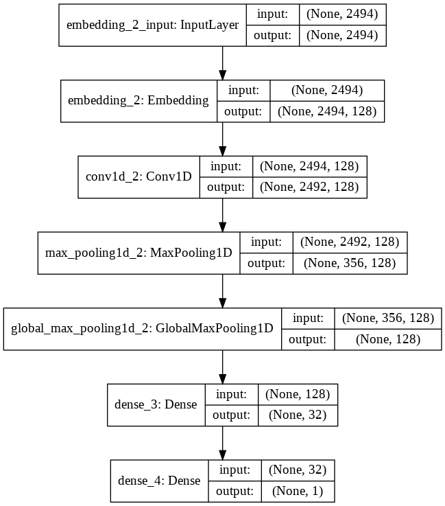

<h1>Sentiment Analysis using CNN</h1>

<h2 id="intro">Introduction</h2>

Sentiment Analysis has been a classic field of research in Natural Language Processing, Text Analysis and Linguistics. It essentially attempts to identify, categorize and possibly quantify, the opinions expressed in a piece of text and determine the author's attitude toward a topic, product or situation. This has widespread application in Recommender systems for predicting the preferences of users and in e-commerce websites to analyse customer feedback & reviews. Based on the sentiments extracted from the data, companies can better understand their customers and align their businesses accordingly.  
Before the advent of the Deep Learning era, Statistical methods and Machine Learning techniques found ample usage for Sentiment Analysis tasks. With the increase in the size of datasets and text corpora available on the internet, coupled with advancements in GPUs and computational power available for these tasks, Neural Networks have ushered in and vastly improved the state-of-the-art performance in various NLP tasks, and Sentiment Analysis remains no exception to this. Recurrent Neural Networks (RNN), Gated RNNs, Long-Short Term Memory networks (LSTM) and 1D ConvNets are some classic examples of neural architectures which have been successful in NLP tasks.  

<h2 id="dataset"> Dataset </h2>

This project uses the <a href="https://ai.stanford.edu/~amaas/data/sentiment/">Large Movie Review Dataset</a> which has been in-built with Keras. This dataset contains 25000 highly polar movie reviews for training, and another 25000 reviews for testing. It does not contain more than 30 reviews for any single movie, and also ensures there are equal number of positive and negative reviews in the both the training and test sets. Additionally, neutral reviews (those with rating 5/10 or 6/10) have been excluded.  
This dataset has been a benchmark for many Sentiment Analysis tasks, since it was first released in 2011.

The idea of Convolutional Networks has been quite common in Computer Vision. The use of convolutional filters to extract features and information from pixels of an image allows the model to identify edges, colour gradients, and even specific features of the image like positions of eyes & nose (for face images). Apart from this, 1D Convolutional Neural Networks have also proven quite competitive with RNNs for NLP tasks. Given a sequential input, 1D CNNs are well able to recognize and extract local patterns in this sequence. Since the same input transformation is performed at every patch, a pattern learned at a certain position in the sequence can very easily later be recognized at a differnt position. Further, in comparison to RNNs, ConvNets in general are extremely cheap to train computationally - In the current project (built using Google Colaboratory with a GPU kernel) the CNN model took hardly 9 seconds on average!
I built the model using Keras Sequential API. A summary of the model and its layers is below.

        

            <figure>
                
                <figcaption> A plot of the model and its layers </figcaption>
            </figure>
        

